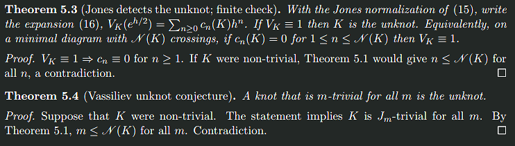

# A Bound on the *m*-Triviality of Knots — Theory & Computational Evidence

> **Note**: This README uses LaTeX math notation with `$...$` for inline math and `$$...$$` for display equations. GitHub renders these automatically. If equations don't display properly, ensure you're viewing on GitHub.com or a compatible Markdown viewer.

**This repository bundles the two companion papers and the full code used for the large‑scale experiments.**  
Part I proves a *uniform barrier* for Jones–Vassiliev truncations and derives unknot‑detection corollaries. Part II implements a finite packaging of the Birman–Lin layers, runs a census up to 19 crossings, and reports empirical patterns that sharpen the barrier.

- 📄 **Part I (PDF):** [`papers/bound_on_m_triviality-detection.pdf`](papers/bound_on_m_triviality-detection.pdf)  
- 📄 **Part II (PDF):** [`papers/bound_on_m_triviality-comp.pdf`](papers/bound_on_m_triviality-comp.pdf)

---
 <div align="center">
    
    
</div>


## TL;DR

- **Uniform barrier (Part I).** If a nontrivial knot $K$ is **Jones–m–trivial** (its Birman–Lin coefficients $c_1,\dots,c_{m-1}$ vanish), then
  $$m \le N(K)\quad\text{(crossing number).}$$
  As a corollary, **the Jones polynomial detects the unknot**: if $V_K(t)\equiv 1$, then $K$ is the unknot. On any minimal diagram with $C$ crossings, vanishing $c_1,\dots,c_C$ is a finite certificate of triviality.


- **Computational evidence (Part II).** Using the **Jones–Vassiliev polynomial (JVP)** in $\mathbb{Z}[p][x]/(x^2-px-1)$, we classify $J_m$-trivial knots by the $p$-adic order of $V_K-1$ and verify the barrier across **352,152,252** prime knots with $N\le 19$. Data obey a stricter empirical cap
  $$m \le \Big\lfloor \tfrac{N(K)}{2}\Big\rfloor + 1,$$
  and reproduce the symbol‑skein recursion and the **last‑row fingerprint**. See Fig. 3 (first occurrences, Part II p. 14) and Fig. 4 (likelihood curves, Part II p. 15).

---

## Repository Layout

```
.
├── papers/                             # Theoretical papers (PDFs)
│   ├── bound_on_m_triviality-detection.pdf
│   └── bound_on_m_triviality-comp.pdf
|
├── JonesData/                          # Jones polynomial related data
│   ├── jones_0_to_12.json              # Jones coefficients up to 12 crossings scraped from Knot Atlas
│   └── Jm_index_knot_ids/              # Knots and their Jm-triviality values used for visualization 
│
├── OptimizedJonesScraper1.py           # Download Jones polynomial data
├── JVP.py                              # Jones-Vassiliev polynomial converter
├── BLexpansion.py                      # Birman-Lin expansion calculator
├── Jm_triviality.py                    # Main processor (Jm-triviality index)
├── visualize.py                        # Generates interactive HTML visualizer
├── plot_Jm_cdf.py                      # Jm-triviality cumulative probability plotter
│
├── Jm_trivial_knots_up_to_19.md        # Results: first few occurrences of Jm-trivial knots
├── output_example.txt                  # Example workflow output
│
├── requirements.txt                    # Python dependencies
└── README.md                           # This file
```

### Core Scripts

| Script | Purpose |
|--------|---------|
| **OptimizedJonesScraper1.py** | Downloads Jones polynomial coefficient data from online repositories (Knot Atlas, Dartmouth) |
| **JVP.py** | Converts Jones polynomials to Jones–Vassiliev polynomial (JVP) form in $\mathbb{Z}[p][x]/(x^2-px-1)$ |
| **BLexpansion.py** | Computes Birman–Lin (Taylor) expansion coefficients from Jones polynomials |
| **Jm_triviality.py** | Main processing pipeline: splits large JSON files, computes Jm-triviality indices in parallel, generates statistics |
| **visualize.py** | Creates interactive HTML visualization of knot chunks by crossing number and triviality class |
| **plot_Jm_cdf.py** | Plots cumulative probability distributions $P_m(N)$ for Jm-triviality |

### Data Files

| File | Description |
|------|-------------|
| **Jm_probs.json** | Conditional probabilities $P(m \mid N)$ for each crossing number  (output of `Jm_triviality.py`)|
| **knot_ids.json** | Knot chunks organized by $J_m$-triviality index (output of `Jm_triviality.py`) |
| **jones_*.json** | Downloaded Jones polynomial coefficient datasets (from scraper) |

---

## Installation

### Requirements

- Python ≥ 3.10
- 4+ GB RAM for processing large datasets
- ~10 GB disk space for full 19-crossing dataset

### Setup

```bash
# Clone the repository
git clone <repository-url>
cd Jones-m-triviality

# Create virtual environment
python -m venv .venv
source .venv/bin/activate  # On Windows: .venv\Scripts\activate

# Install dependencies
pip install -r requirements.txt

# Optional: install development tools
pip install -r requirements-dev.txt  # if available
```

### Dependencies

The `requirements.txt` includes:
- `ijson` — Streaming JSON parser for large files
- `numpy` — Numerical computations
- `matplotlib` — Plotting and visualization
- `pandas` — Data manipulation

---

## Quick Start

### Complete Workflow Example

Here's a typical workflow to analyze knots with 13-15 crossings:

```bash
# Step 1: Download Jones polynomial data
./OptimizedJonesScraper1.py --source dartmouth --crossing 13-15 --out j13_15.json

# Step 2: Compute Jm-triviality indices
./Jm_triviality.py j13_15.json 2

# Step 3: Visualize the results
./visualize.py knot_ids.json

# Step 4: Plot cumulative probabilities
./plot_Jm_cdf.py Jm_probs.json --dark --scheme green
```

Expected outputs:
- `j13_15.json` — Jones coefficients for ~310,000 knots
- `Jm_probs.json` — Updated probability distribution
- `knot_ids.json` — Knot chunks by Jm-class
- `Jm_visualizer.html` — Interactive visualization
- `jm_cumulative_probs.pdf` — Publication-quality plot

---

## Detailed Usage

### 1. OptimizedJonesScraper1.py

Downloads Jones polynomial coefficient data from online repositories.

**Usage:**
```bash
./OptimizedJonesScraper1.py [options]

Options:
  --source <dartmouth|knotatlas>  Data source (default: dartmouth)
  --crossing <N> or <N-M>         Single crossing number or range
  --out <filename>                Output JSON file (default: jones_data.json)
  --help                          Show help message
```

**Examples:**
```bash
# Download 13-crossing knots from Dartmouth
./OptimizedJonesScraper1.py --source dartmouth --crossing 13 --out jones_13.json

# Download crossing numbers 14-16
./OptimizedJonesScraper1.py --source dartmouth --crossing 14-16 --out jones_14_16.json

# Download from Knot Atlas (0-10 crossings)
./OptimizedJonesScraper1.py --source knotatlas --crossing 0-10 --out jones_0_10.json
```

**Output Format:**
```json
{
  "data": {
    "3_1": {
      "coeffs": {"1": 1, "3": 1, "4": -1}
    },
    "4_1": {
      "coeffs": {"-2": 1, "-1": -1, "0": 1, "1": -1, "2": 1}
    },
    ...
  }
}
```

---

### 2. Jm_triviality.py

Main processing script that computes Jm-triviality indices using parallel processing.

**Usage:**
```bash
./Jm_triviality.py <json_file> [n_workers] [options]

Arguments:
  json_file                Input Jones polynomial data (JSON)
  n_workers                Number of parallel workers (default: CPU count)

Options:
  --R <JVP|Birman-Lin>    Representation method (default: JVP)
  --S <n>                 Sample interval for knot_ids (default: 1)
  --K <filename>          Output knot chunks file (default: knot_ids.json)
```

**Examples:**
```bash
# Process with 10 workers using JVP representation
./Jm_triviality.py jones_13_15.json 10

# Use Birman-Lin expansion instead of JVP
./Jm_triviality.py jones_13_15.json 10 --R Birman-Lin

# Sample every 10000th knot for knot_ids
./Jm_triviality.py jones_17.json 10 --S 10000 --K knot_ids_17.json

# Process all available cores
./Jm_triviality.py jones_0_12.json
```

**How It Works:**

1. **Ultra-fast splitting**: Divides large JSON files by byte position, fixes boundaries at record edges
2. **Parallel processing**: Each worker processes a split file independently
3. **Two representations**:
   - **JVP (default)**: Computes $p$-adic order in $\mathbb{Z}[p][x]/(x^2-px-1)$
   - **Birman-Lin**: Computes order of first non-zero Taylor coefficient
4. **Results merging**: Aggregates statistics and identifies maximally Jm-trivial knots

**Output:**

Updates two JSON files:

**Jm_probs.json** — Conditional probabilities $P(m|N)$:
```json
{
  "13": [0.88, 0.099, 0.016, 0.0062, 0.0001],
  "14": [0.88, 0.094, 0.024, 0.0032, 0.00083, 0.0, 2.1e-05],
  ...
}
```

**knot_ids.json** — Knot chunks by Jm-index:
```json
{
  "2": [[crossings, id_start, id_end, label], ...],
  "3": [[13, 71, 71, "13a_hyp_jones:71"], ...],
  ...
}
```

**Console output:**
```
============================================================
RESULTS
============================================================

13 crossings. Maximally trivial m=6; Knot 13n_hyp_jones:4278
9988 knots. Jm-trivial probabilities: J2: 0.88 | J3: 0.099 | J4: 0.016 | J5: 0.0062 | J6: 0.0001

14 crossings. Maximally trivial m=8; Knot 14a_hyp_jones:19509
46972 knots. Jm-trivial probabilities: J2: 0.88 | J3: 0.094 | J4: 0.024 | J5: 0.0032 | J6: 0.00083 | J7: 0.0 | J8: 2.1e-05
...
```

---

### 3. visualize.py

Creates an interactive HTML visualization showing knot distribution by crossing number and Jm-triviality class.

**Usage:**
```bash
./visualize.py [options] <knot_id_json_files...>

Options:
  --c <green|purple>      Color scheme (default: green)
  --o <output.html>       Output HTML file (default: Jm_visualizer.html)
```

**Examples:**
```bash
# Visualize with default green theme
./visualize.py knot_ids.json

# Use purple color scheme
./visualize.py --c purple --o viz_purple.html knot_ids.json

# Combine multiple knot_ids files
./visualize.py knot_ids_13.json knot_ids_14.json knot_ids_15.json
```

**Features:**
- **Radial layout**: Concentric circles represent crossing numbers (3-19)
- **Class sectors**: 9 sectors for Jm-triviality classes (J2-J10)
- **Interactive**: Hover over points for knot details, click sectors to highlight classes
- **Bezier curves**: Connect knots to their triviality class centers
- **Statistics panel**: Shows chunk counts, represented knots, crossing ranges

**Output:** Opens `Jm_visualizer.html` in your browser showing the interactive visualization.

---

### 4. plot_Jm_cdf.py

Generates publication-quality plots of cumulative probabilities $P_m(N)$.

**Usage:**
```bash
./plot_Jm_cdf.py <Jm_probs.json> [options]

Options:
  -o, --output <file>     Output file (default: jm_cumulative_probs.pdf)
  --stats                 Print statistics table
  --dark                  Use dark theme (black background)
  --scheme <green|purple> Color scheme for dark theme (default: green)
```

**Examples:**
```bash
# Generate PDF with default light theme
./plot_Jm_cdf.py Jm_probs.json

# Dark theme with green neon colors
./plot_Jm_cdf.py Jm_probs.json --dark --scheme green -o jm_plot_dark.pdf

# Include statistics table
./plot_Jm_cdf.py Jm_probs.json --stats

# PNG output
./plot_Jm_cdf.py Jm_probs.json -o jm_plot.png
```

**Output:**

Produces a logarithmic plot showing:
- **X-axis**: Crossing number $N$ (3-20)
- **Y-axis**: Cumulative probability $P_m(N)$ (log scale)
- **Curves**: One for each Jm-class (J3-J10)
- **Labels**: Inline labels at curve endpoints

With `--stats`:
```
======================================================================
Cumulative Probability Statistics P_m(N)
======================================================================
m     P_m(8)       P_m(12)      P_m(17)      Growth      
----------------------------------------------------------------------
3     0.113845     0.093841     0.091523     0.80x
4     0.020952     0.018721     0.016826     0.80x
5     0.004762     0.003512     0.003735     0.78x
...
======================================================================
```

---

### 5. JVP.py

Converts Jones polynomials to Jones–Vassiliev polynomial (JVP) representation.

**Usage (as library):**
```python
from JVP import jones_to_Vxp

# Standard Jones polynomial: V(q) = -q^4 + q^3 + q (trefoil)
coefs = {4: -1, 3: 1, 1: 1}
A, B = jones_to_Vxp(coefs, input_q_is_half_power=False)

# A(p), B(p) are dictionaries: degree -> coefficient
# V(x,p) = A(p) + B(p) * x in Z[p][x]/(x^2 - px - 1)
```

**Standalone testing:**
```bash
python JVP.py
```

Runs validation tests on trefoil, unlink, Hopf link, etc.

---

### 6. BLexpansion.py

Computes Birman–Lin (Taylor) expansion coefficients.

**Usage (as library):**
```python
from BLexpansion import taylor_from_jones

# Jones polynomial coefficients
coefs = {4: -1, 3: 1, 1: 1}  # trefoil

# Get Taylor coefficients [a_0, a_1, ..., a_n]
# where V(e^h) = sum_{m=0}^n a_m h^m + O(h^{n+1})
taylor_coeffs = taylor_from_jones(coefs, n=11)

# For half-power input (q = x^{1/2}):
coefs_half = {8: -1, 6: 1, 2: 1}
taylor_coeffs = taylor_from_jones(coefs_half, n=11, exponent_den=2)
```

**Standalone testing:**
```bash
python BLexpansion.py
```

Computes Jm-triviality index for a sample knot.

---

## Theory Summary

### Part I — Theory (uniform barrier & detection)

- **Barrier (Thm. 5.1).** If $K$ is nontrivial and Jones–$m$–trivial then $m\le N(K)$. The proof uses **extended shadows**: decorate each crossing $j$ with a degree–$m_j$ clasper so flipping $j$ is a $C_{m_j}$-move invisible below order $m_j$. A **weighted Goussarov–Habiro filtration** gives an **$m$-flat family** for all order $<m$ layers. *(See the crossing–flip–mod–$C_m$ "movie" in Part I, Fig. 1, p. 13.)*

- **Symbol calculus & last–row fingerprint (Thm. 4.10).** In the Birman–Lin expansion $V_K(e^{h/2})=\sum c_n h^n$, the order–0 term $c_0(L)=(-2)^{\ell(L)-1}$ counts components. A symbol–level skein shows that on any Jones–$m$–flat subcube, smoothing any prescribed $m-1$ crossings forces
  $$c_0=(-2)^{m-1},$$
  i.e. the component count increases by exactly one per smoothing—**property (P)**. *(See the symbol matrix in Part I, Fig. 2, p. 20.)*

- **Shadow criterion (Lemma B.1).** If (P) holds on all crossings of a shadow, every crossing is nugatory and the shadow is a tree; hence every carried diagram is an unknot. This collapses any supercritical Jones–$m$–flat face and yields the barrier when $m$ exceeds the number of varied crossings. *(Proof: Part I, Appendix B, pp. 24–26.)*

- **Detection corollaries.** If $V_K\equiv1$ then $K$ is the unknot (Thm. 5.3). If *all* finite‑type invariants vanish (GH $m$-trivial for all $m$), then $K$ is the unknot (Thm. 5.4).
  <div align="center">
    
  </div>

### Part II — Computation (finite packaging & large‑scale evidence)

- **Jones–Vassiliev polynomial (JVP).** In $R=\mathbb Z[p]$ with $R[x]/(x^2-px-1)$, each Jones polynomial has a unique finite expansion
  $$V_K(x)=\sum_{q\ge0}\big(a_q(K)+b_q(K)\,x\big)p^q,\qquad c_q:=a_q+b_q,$$
  where each $a_q,b_q$ has Vassiliev order $\le q$. Extract $(a_q,b_q)$ from $V_K(t)$ via $t^{1/2}=x,\ t^{-1/2}=x-p$, plus the reduction $x^2=px+1$. The **$p$-adic order of $V_K-1$** equals the $J_m$–triviality index $m(K)$ ("bandwidth").

  <div align="center">
    
  </div>

- **Census up to 19 crossings.** Using Knot Atlas (≤10) and Dartmouth (11–19) datasets, we observe the barrier and an empirical refinement $m \le \lfloor N/2\rfloor + 1$ throughout. We also confirm a **min–law** under connected sum $m(K_0\#K_1)=\min\{m(K_0),m(K_1)\}$. *(Figures: Part II, pp. 14–15.)*

<div align="center">
    
  </div>

---

## Self‑contained Proof Sketch (Uniform Barrier & Detection)

1. **Make flips invisible below $m$.** On a fixed shadow $S$, attach a degree–$m_j$ clasper near each crossing $j$; flipping $j$ becomes a $C_{m_j}$-move, so all invariants of order $<m_j$ can't see it. With $m=\min_j m_j$, the carried family is **$m$-flat** for all order $<m$ data.

2. **Force the last–row fingerprint.** On any Jones–$m$–flat subcube, all $c_1,\dots,c_{m-1}$ are constant (and on a $J_m$–trivial vertex, zero). The symbol–skein collapses to a bottom–row constraint: after smoothing any fixed $m-1$ crossings, $c_0=(-2)^{m-1}$ ⇒ (P): "+1 component per smoothing."

3. **Collapse supercritical faces.** If $m$ exceeds the number $d$ of varied crossings, (P) holds on all of them; the **Shadow Lemma** forces the shadow to be a tree, so the entire cube consists of unknots—a contradiction for nontrivial $K$. Hence $m\le d$. Taking a minimal shadow yields $m\le N(K)$.

4. **Detection.** If $V_K\equiv1$ then $K$ would be $J_m$-trivial for all $m$, contradicting the barrier unless $K$ is the unknot; similarly for GH $m$-triviality for all $m$.

---

## Results: Maximally Jm-Trivial Knots

See [`Jm_trivial_knots_up_to_19.md`](Jm_trivial_knots_up_to_19.md) for the complete list of first occurrences.

**Highlights:**
- **8 crossings**: First J3-trivial (8₂), first J4-trivial (8₁₄)
- **14 crossings**: First J8-trivial (14a_hyp_jones:19509)
- **17 crossings**: First J9-trivial (17a_hyp_jones:1743282)
- **19 crossings**: Multiple J9-trivial knots observed

**Empirical pattern:** $m \le \lfloor N/2 \rfloor + 1$ holds for all 352+ million knots tested.

---

## Performance Notes

### Processing Times

On a typical workstation (16-core CPU, 32 GB RAM):

| Dataset | Knots | Workers | Time |
|---------|-------|---------|------|
| 13-15 crossings | 310,253 | 10 | ~21 seconds |
| 17 crossings | 8,053,393 | 16 | ~8 minutes |
| 18 crossings | 48,266,466 | 16 | ~45 minutes |
| 19 crossings | 294,130,458 | 16 | ~5 hours |

### Memory Requirements

- **Scraper**: ~500 MB for largest single downloads
- **Jm_triviality.py**: ~2-4 GB total (distributed across workers)
- **visualize.py**: ~1 GB for loading/processing, negligible for HTML output
- **plot_Jm_cdf.py**: <100 MB

### Optimization Tips

1. **Use more workers**: Set to CPU count or slightly higher
2. **Sample knot_ids**: Use `--S 1000` or higher for 17+ crossings to reduce output size
3. **Process in batches**: Download and process one crossing number at a time
4. **SSD recommended**: For faster JSON I/O with large files

---

## Troubleshooting

### Common Issues

**Issue**: `ImportError: No module named 'ijson'`  
**Solution**: Run `pip install -r requirements.txt`

**Issue**: Scraper download fails  
**Solution**: Check internet connection, try different source (`--source knotatlas`)

**Issue**: `Jm_triviality.py` crashes with memory error  
**Solution**: Reduce number of workers or process smaller crossing ranges

**Issue**: JSON parsing errors in split files  
**Solution**: Re-run with fresh download; file may be corrupted

**Issue**: Visualization doesn't show all knots  
**Solution**: Increase max_chunks in `visualize.py` (default 20,000)

---

## Citing This Work

If you use the theory or the code, please cite both parts:

> A. Carmi and E. Cohen, **A bound on the *m*-triviality of knots — Part I: Jones–Vassiliev unknot detection** (see `papers/bound_on_m_triviality-detection.pdf`).  

> A. Carmi and E. Cohen, **A bound on the *m*-triviality of knots — Part II: Computational evidence** (see `papers/bound_on_m_triviality-comp.pdf`).

---

## Contributing

Contributions are welcome! Areas for improvement:

- Extension to 20+ crossings to find the first $J_{\geq 10}$-trivial knots.

Please open an issue or submit a pull request.

---

## License

[Add your license here]

---

## Acknowledgments

We thank the maintainers of:
- **Knot Atlas** (https://katlas.org/wiki/Main_Page)
- **Dartmouth Knot Database** (https://knots.dartmouth.edu/jones_polynomial/)

for providing comprehensive Jones polynomial datasets that made this computational study possible.

---

## Contact

[Add contact information here]